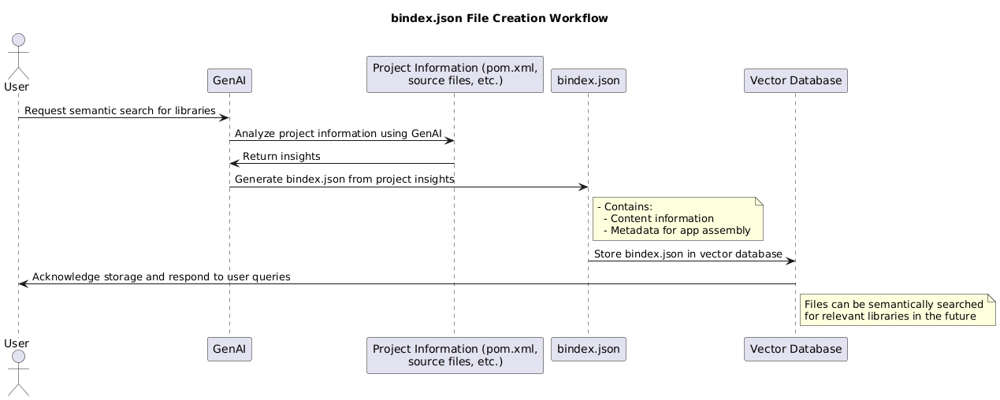
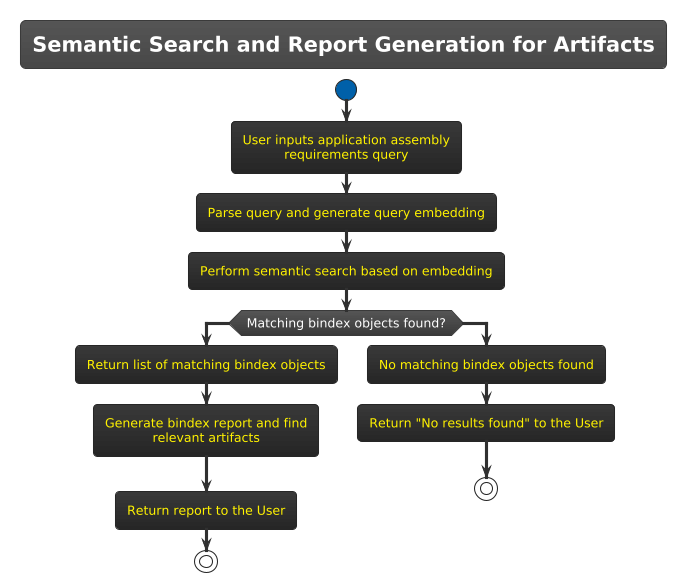
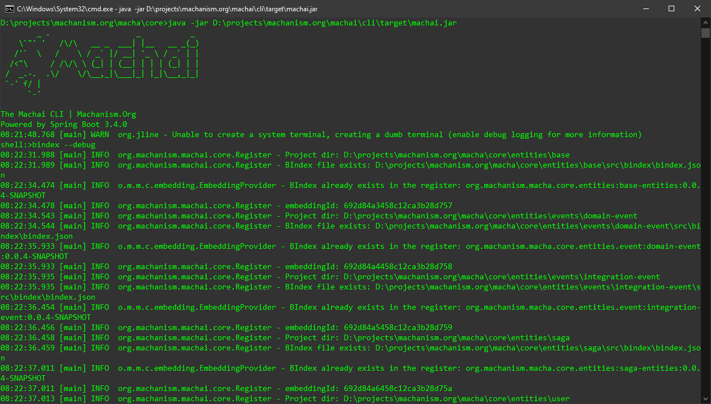
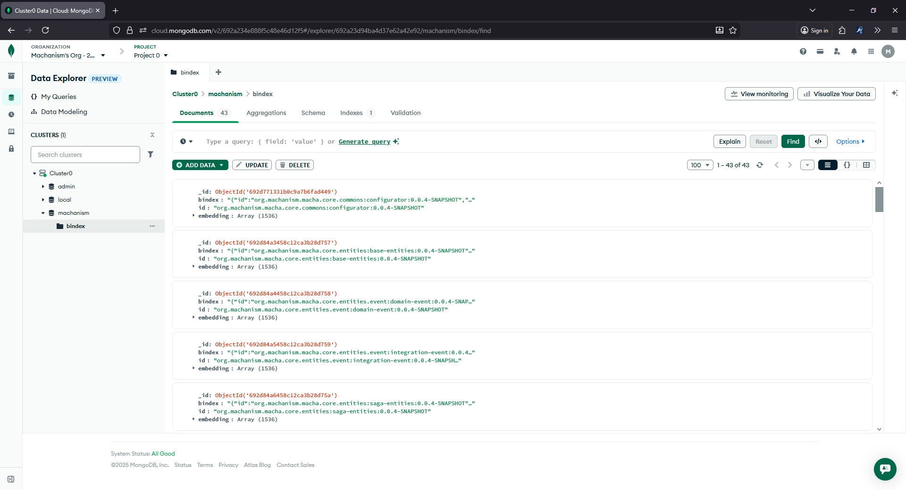
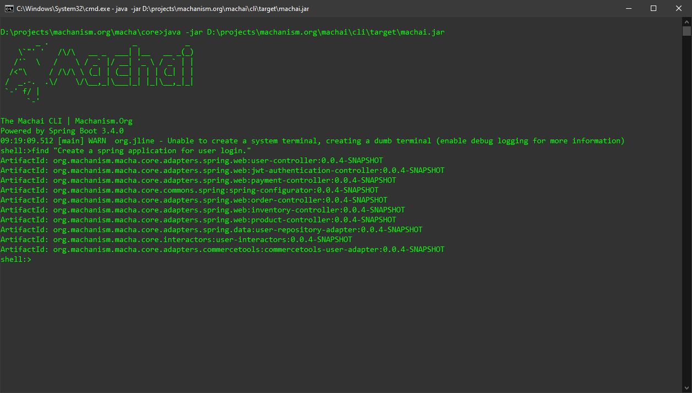

# Machai | Machanism.Org

## BINDEX.JSON

The `bindex.json` is a descriptor file that encapsulates library and content information, which can be used to automatically assemble customer applications. This process leverages GenAI to analyze project information and store the descriptor file in a vector database for semantic search functionality in response to user queries. 

### BINDEX Generation and Registration

Below is a breakdown of the workflow:

#### 1. Bindex Creation Request
The process begins with the user initiating a request to create and register a Bindex file.

#### 2. Analysis of Project Information
GenAI analyzes various project artifacts to extract relevant information. These include:
   - **`pom.xml`:** The configuration file of Java-based projects using Apache Maven.
   - **Source Code Files:** Analyzed to extract API usage, coding patterns, and other relevant information.
   - **Other Metadata:** Description, author information, and the high-level purpose of the project.
   
GenAI uses its advanced natural language understanding and pattern recognition capabilities to process both structured and unstructured content of the project files. 

#### 3. Generating `bindex.json`
Based on the analysis, GenAI generates the `bindex.json` file. This file serves as the descriptor of the library and application-specific content. It typically contains:
   The `bindex.json` file contains the following information:

##### Overview of Information Contained in `bindex.json`

The `bindex.json` file provides essential metadata for describing an artifact. It contains the following key pieces of information:

- Basic Artifact Metadata
- Authorship and Legal Information
- Categorization and Search Tags
- Artifact Storage and Repository Information
- Technical Details
- Extension and Integration Points

In summary, the `bindex.json` file acts as a well-structured descriptor for artifacts. It contains metadata, technical details, and integration points to enable automated application assembly and improve searchability through semantic embeddings.

This compact list outlines the high-level structure and content of the `bindex.json` file.

The `bindex.json` file is created programmatically to ensure it complies with a predefined [schema](https://machanism.org/machai/schema/bindex-schema-v1.json) for consistency.

#### 4. Storing `bindex.json` in a Vector Database
Once created, the `bindex.json` file is stored in a vector database. Vector databases are specifically designed for operations such as storing and retrieving embeddings, thus allowing efficient **semantic search** and ranking.

   - The contents of the `bindex.json` file are indexed using semantic embeddings, ensuring that the file can be retrieved based on meaning, not just exact keywords.
   - The search and indexing process ensures that developers can quickly find relevant libraries and files based on high-level queries.

### BINDEX Schema

Schema location: https://machanism.org/machai/schema/bindex-schema-v1.json or [bindex-schema-v1.json](core/src/main/resources/schema/bindex-schema-v1.json)

| Property Name | Type | Description |
| :-- | :-- | :-- |
| id | string | A unique identifier for the artifact (e.g.: [groupId]:[artifactId]:[version]). |
| name | string | The full name of the artifact, commonly formatted as groupId:artifactId for Maven artifacts. |
| version | string | The version of the artifact, typically using semantic versioning, tags, or hashes. |
| description | string | A critical property used to generate embeddings for semantic search in application assembly. This description must provide all relevant contextual and project-specific information, automatically generated from the project description and additional content as needed. |
| author | object | Information about the author or organization responsible for the artifact, including name, email, and website. |
| license | string | The license type that governs the artifact (e.g.: MIT, Apache 2.0, etc.). |
| tags | array | A list of keywords or tags describing the artifact to enhance discoverability. |
| classification | object | Categorization details about the artifact, including type (library, plugin), domain, and supported programming languages. |
| location | object | Information about where the artifact is stored, including repository type, URL, and coordinates within the repository. |
| features | array | A list of the main capabilities or features provided by the artifact, including their details and code examples. |
| techStack | array | A collection of technologies, frameworks, tools, and runtimes that are used by the artifact (e.g.: Docker, Kubernetes, Java). |
| customizations | array | Developer extension points provided by the artifact, including classes, interfaces, and configurable options. |
| studs | array | Definitions of interfaces or abstract classes that are designed to be extended or implemented by other modules. |

## Assembly 

### Semantic Search

When the user queries the system, the vector database utilizes its semantic indexes to identify the most relevant results — finding libraries or related components based on "intent" rather than exact matches. The user is notified of the availability of the requested files or relevant results.

##  CLI

