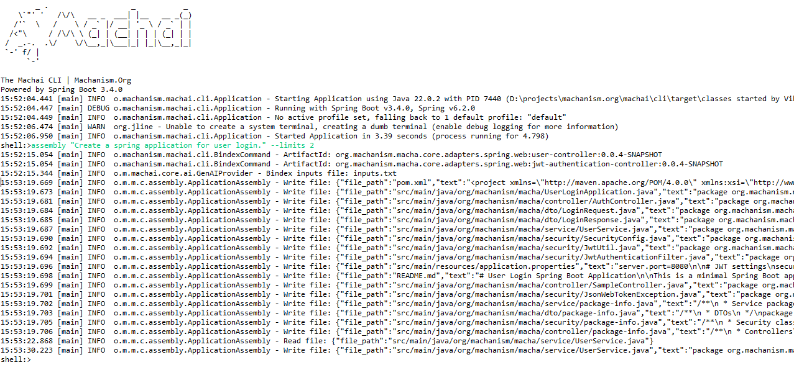

# Machai | Machanism.Org

## Creating and registering Bindex


## Assembly



## Result

```text
src/
  main/
    java/
      com/
        example/
          loginapp/
            LoginApplication.java
            config/
              UserInteractorConfig.java
            controller/
              AuthController.java
            dto/
              LoginRequest.java
              RegisterRequest.java
    resources/
      application.properties
pom.xml
README.md
```

```xml
<!-- pom.xml -->
<project xmlns="http://maven.apache.org/POM/4.0.0"
         ...>
    <modelVersion>4.0.0</modelVersion>
    <groupId>com.example</groupId>
    <artifactId>loginapp</artifactId>
    <version>1.0.0-SNAPSHOT</version>
    <packaging>jar</packaging>
    <name>LoginApp</name>
    <description>Spring Boot application for user login using machanism artifacts.</description>

    <parent>
        <groupId>org.springframework.boot</groupId>
        <artifactId>spring-boot-starter-parent</artifactId>
        <version>3.2.6</version>
        <relativePath />
    </parent>

    <properties>
        <java.version>17</java.version>
    </properties>

    <dependencies>
        <dependency>
            <groupId>org.springframework.boot</groupId>
            <artifactId>spring-boot-starter-web</artifactId>
        </dependency>
        <dependency>
            <groupId>org.springframework.boot</groupId>
            <artifactId>spring-boot-starter-data-jpa</artifactId>
        </dependency>
        <dependency>
            <groupId>org.machanism.macha.core.adapters.spring.web</groupId>
            <artifactId>user-controller</artifactId>
            <version>0.0.4-SNAPSHOT</version>
        </dependency>
        <dependency>
            <groupId>org.machanism.macha.core.interactors</groupId>
            <artifactId>user-interactors</artifactId>
            <version>0.0.4-SNAPSHOT</version>
        </dependency>
        <dependency>
            <groupId>org.machanism.macha.core.adapters.spring.data</groupId>
            <artifactId>user-repository-adapter</artifactId>
            <version>0.0.4-SNAPSHOT</version>
        </dependency>
        <dependency>
            <groupId>org.machanism.macha.core.adapters.spring.web</groupId>
            <artifactId>jwt-authentication-controller</artifactId>
            <version>0.0.4-SNAPSHOT</version>
        </dependency>
        <!-- H2 for in-memory DB -->
        <dependency>
            <groupId>com.h2database</groupId>
            <artifactId>h2</artifactId>
            <scope>runtime</scope>
        </dependency>
    </dependencies>

    <build>
        <plugins>
            <plugin>
                <groupId>org.springframework.boot</groupId>
                <artifactId>spring-boot-maven-plugin</artifactId>
            </plugin>
        </plugins>
    </build>
</project>
```

