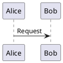

<!-- @guidance: 
Create a user manual web page titled "Guidance Tag" that explains the guidance tag processing feature.
**Instructions:**
1. **Purpose and Overview**
   - Begin with a clear, user-friendly introduction to what the guidance tag is and its role in the Machai system.
   - Summarize the main purpose and benefits of guidance tag processing, focusing on how it helps users automate and enhance file processing.
2. **How It Works**
   - Review the `src/main/java/org/machanism/machai/gw/processor/GuidanceProcessor.java` and classes in folder: `src/main/java/org/machanism/machai/gw/reviewer`.
   - Describe the supported features from a user perspective using simple, accessible language.
   - Explain the key features of the GuidanceProcessor, avoiding technical jargon.
   - Highlight how users can take advantage of these features in their own projects.
   - Use information from the web page https://machanism.org/guided-file-processing/index.html (css selector: `.md-content`) to describe how it work.
3. **Practical Usage**
   - Provide step-by-step instructions or real-world scenarios showing how to use the guidance tag feature.
   - Include practical examples, such as how to add a guidance tag to a file and what happens during processing.
   - Use bullet points or numbered lists to make instructions easy to follow.
4. **Why Use Guidance Tags?**
   - Clearly explain the advantages of using guidance tags, such as saving time, reducing manual work, and ensuring consistency in file processing.
   - Mention how this feature can benefit both technical and non-technical users.
5. **Further Resources**
   - Include a link to [Guided File Processing](https://machanism.org/guided-file-processing/index.html) for users who want to learn more.
6. **Accessibility and Readability**
   - Organize the page with clear headings and concise paragraphs.
   - Use bullet points, lists, and examples to improve readability.
   - Ensure the content is approachable for users of all backgrounds, including those new to the codebase or without technical experience.
**Important:**  
- Do not assume prior knowledge of the Machai project or its codebase.
- Focus on clarity, simplicity, and practical value for end users.
-->

# Guidance Tag

A guidance tag is a plain-language instruction you keep **inside the file it concerns**. Machai Ghostwriter reads these instructions during Guided File Processing and uses them to prepare an AI-assisted update. Think of a tag as a note in the margin: it tells the assistant what you want, while you remain responsible for the final result.

Guidance tags help automate routine work such as improving documentation, creating website content, or adding tests. They do not change how your application runs, add dependencies, or affect source data at runtime. Because the instruction lives with the project, it can be reviewed, versioned, reused, and refined by the whole team. You can also use the saved instruction as a checklist for manual work when AI processing is not appropriate.

## How it works


1. Add an `@guidance:` tag in a supported file, or add a folder instruction file named `@guidance.txt`.
2. Run Ghostwriter and choose a project folder and, optionally, a scan path.
3. Ghostwriter—not the AI—finds matching supported files that contain guidance and gives each file its own processing context. If your run is configured with default guidance, matching files can instead use that default instruction.
4. A file-type-aware reviewer recognizes the tag and provides the relevant instruction, file information, and, where appropriate, file content to the processing request.
5. Ghostwriter combines this material with its standard processing rules and sends it to your configured GenAI provider. Review the result, then revise the tag and run again if needed.

This follows the Guided File Processing approach: natural-language instructions are treated as maintainable project assets. AI is useful for routine enrichment—explaining existing code, adding examples, or organizing text—but it cannot know your project-specific intent unless you state it in the guidance.

### Scope and processing order

The **project folder** is the base directory Ghostwriter examines. A **scan path** narrows that work to a file, folder, glob pattern, or regular expression; it can be relative or absolute. A narrow scan is useful when you want to update only one documentation area or module.

Ghostwriter recognizes project modules and processes child modules before the parent project. Files deeper in the directory structure are considered first, which helps when a top-level file relies on information from lower-level files. Child modules may run in declared order or in parallel when multithreading is enabled; a build tool can instead determine the module order from dependencies.

### Supported files and tag styles

Reviewers recognize these built-in file types:

| File type | Extension(s) | Where to put the tag |
| --- | --- | --- |
| HTML, HTML fragments, and XML | `html`, `htm`, `xml` | An HTML/XML comment: `<!-- @guidance: ... -->` |
| Markdown | `md` | An HTML comment: `<!-- @guidance: ... -->` |
| Java | `java` | A block or `//` comment |
| TypeScript | `ts` | A block or `//` comment |
| Python | `py` | A `#` comment or triple-quoted string |
| PlantUML | `puml` | Include the marker, normally in a PlantUML comment |
| Folder instruction | exactly `@guidance.txt` | Put the instruction in that file |

An ordinary `.txt` file is not an inline-guidance file: text files have no comment syntax. `@guidance.txt` is the exception and represents guidance for its folder. Java's `package-info.java` can also provide package-level guidance.

The exact comment format matters. For example, the Markdown and HTML reviewers look for an HTML comment, while the Java reviewer accepts a normal block or line comment. Tags are retained in the source so they can be found in a later run.

## Practical usage

### Add guidance to a Markdown page

1. Open the page you want to update.
2. Add an HTML comment near the top.
3. State the audience, required content, and anything that must not change.
4. Run Ghostwriter for the project or a targeted scan path.
5. Check the proposed update and improve the instruction before rerunning if necessary.

```markdown
<!-- @guidance:
Update this README for new users.
Include installation, a short usage example, and support information.
Do not remove existing license details.
-->
```

### Add guidance to source files

Use the comment style appropriate to the language. In Java, for example:

```java
/* @guidance:
 * Add clear documentation for public methods.
 * Include one simple usage example where helpful.
 * Do not change method names or behavior.
 */
```

TypeScript accepts block or `//` comments. Python accepts either a line comment with text on the same line or a triple-quoted string:

```python
'''
@guidance:
- Follow PEP 257 for docstrings.
- Document public classes and functions.
- Do not change runtime behavior.
'''
```

For a PlantUML diagram, place the marker in a diagram comment:



### Guide a folder

Create `@guidance.txt` in the folder. Its full content becomes the folder instruction, making it useful for a shared test style, documentation rules, or requirements for related examples.

```text
Create high-quality unit tests in this folder.
Use descriptive test names.
Cover edge cases and error handling.
Follow the Java version configured by the project.
```

### Run Ghostwriter

After configuring access to a GenAI service and selecting a model, run the standalone application or Maven goal:

```shell
java -jar gw.jar
mvn gw:gw
```

To limit the scan, provide a path or pattern, for example:

```shell
java -jar gw.jar "glob:**/*.md"
mvn gw:gw -Dgw.path="glob:**/*.md"
```

The model selection applies to the run. Run separate scans when different folders need different models or instructions.

## What happens during a run?

`GuidanceProcessor` selects a reviewer by file extension. If no reviewer supports the file, Ghostwriter normally leaves it alone; a configured default instruction is the exception for matching files. A reviewer verifies that guidance is present and builds the material for that file. Markdown, HTML/XML, Java, and PlantUML reviewers provide the file content with its project-relative path; Python and TypeScript reviewers provide the non-blank instruction they find with that context. The special text reviewer reads the full contents of `@guidance.txt` and identifies its folder.

Ghostwriter then invokes the configured provider with the standard instructions and the reviewer material. Its optional functional tools can inspect and modify files, run commands and examine logs, or obtain web information. Tools that modify files, run commands, or make network requests must be enabled and controlled by your settings.

Guidance processing is deliberately focused on the file or folder instruction. It is a lightweight choice for local, repeatable rules. Use an **Act** instead when you need a reusable, multi-step workflow with explicit sequencing across a wider task.

## Why use guidance tags?

- **Save time:** keep recurring instructions instead of repeatedly writing prompts.
- **Reduce manual work:** let Ghostwriter handle routine drafting and updates, then focus on review.
- **Improve consistency:** give related pages, source files, and tests the same clear standards.
- **Keep intent visible:** the instruction stays beside the work and is easy to inspect in version control.
- **Support collaboration:** technical and non-technical contributors can use everyday language to describe the outcome they need.
- **Keep control:** specify project knowledge, protected content, and acceptance criteria; verify every result before accepting it.

## Tips for effective guidance

- Start with the intended outcome and audience.
- List required sections, examples, or checks.
- Say explicitly what must not change.
- Prefer specific requests over “make it better.”
- Keep the tag in a valid comment for the file type.
- Treat the instruction like source code: review and improve it over time.

## Further resources

Learn more about scan paths, project structure, AI services, tools, and the wider workflow in [Guided File Processing](https://machanism.org/guided-file-processing/index.html).
