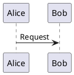

<!-- @guidance: 
Create a user manual web page titled "Guidance Tag" that explains the guidance tag processing feature.
**Instructions:**
1. **Purpose and Overview**
   - Begin with a clear, user-friendly introduction to what the guidance tag is and its role in the Machai system.
   - Summarize the main purpose and benefits of guidance tag processing, focusing on how it helps users automate and enhance file processing.
2. **How It Works**
   - Review the `src/main/java/org/machanism/machai/gw/processor/GuidanceProcessor.java` and classes in folder: `src/main/java/org/machanism/machai/gw/reviewer`.
   - Describe the supported features from a user perspective using simple, accessible language.
   - Explain the key features of the GuidanceProcessor, avoiding technical jargon.
   - Highlight how users can take advantage of these features in their own projects.
   - Use information from the web page https://machanism.org/guided-file-processing/index.html (css selector: `.md-content`) to describe how it work.
3. **Practical Usage**
   - Provide step-by-step instructions or real-world scenarios showing how to use the guidance tag feature.
   - Include practical examples, such as how to add a guidance tag to a file and what happens during processing.
   - Use bullet points or numbered lists to make instructions easy to follow.
4. **Why Use Guidance Tags?**
   - Clearly explain the advantages of using guidance tags, such as saving time, reducing manual work, and ensuring consistency in file processing.
   - Mention how this feature can benefit both technical and non-technical users.
5. **Further Resources**
   - Include a link to [Guided File Processing](https://machanism.org/guided-file-processing/index.html) for users who want to learn more.
6. **Accessibility and Readability**
   - Organize the page with clear headings and concise paragraphs.
   - Use bullet points, lists, and examples to improve readability.
   - Ensure the content is approachable for users of all backgrounds, including those new to the codebase or without technical experience.
**Important:**  
- Do not assume prior knowledge of the Machai project or its codebase.
- Focus on clarity, simplicity, and practical value for end users.
-->

# Guidance Tag

A guidance tag is a plain-language instruction that you place in a file to tell Machai Ghostwriter what you want done with that file. Instead of repeatedly describing the same task in a chat window, you keep the instruction close to the content, code, or configuration that needs attention. This is the central idea of **Guidance-Driven Processing (GDP)**: instructions become maintainable, in-context project assets rather than disposable chat messages.

In the Machai system, guidance tags are part of **Guided File Processing**. This means Ghostwriter scans selected files, reads your instructions, and uses them to help update documentation, source comments, tests, project metadata, or other supported files. The guidance itself does not change how your application runs; it is used only during processing.

## Purpose and overview

Guidance tag processing helps users automate file work while staying in control. You describe the desired result in normal language, and Ghostwriter uses that instruction as the starting point for processing.

You can use guidance tags to ask Ghostwriter to:

- improve a document for a specific audience,
- add or update code comments,
- generate or refine tests,
- keep README files and project documentation consistent,
- extract useful information from source or test code,
- preserve important sections while updating the rest of a file,
- or apply a shared writing, documentation, or review style.

The main benefits are:

- **Less repeated prompting:** write instructions once and reuse them.
- **More consistent output:** keep rules with the files that need them.
- **Better traceability:** review guidance changes in version control.
- **Accessible automation:** use plain language instead of a complex scripting language.
- **Human control:** Ghostwriter acts on explicit instructions that users can read, edit, and review.

Guided File Processing treats prompts as a maintainable project asset. Like source code or documentation, guidance can be stored in the project, reviewed by teammates, improved over time, and committed to the repository.

## How it works

Guided File Processing begins with the project area and scan path you choose. Ghostwriter scans that scope without asking AI to discover the files, selects files containing `@guidance` (and special folder guidance where applicable), reads the instructions, and prepares a separate processing context for each file. You can run the same instructions manually, but a configured GenAI service can perform the routine transformation while you verify the result.


From a user perspective, the workflow is:

1. You add an `@guidance:` instruction to a file, or provide folder-level guidance.
2. You run Ghostwriter for a selected project, folder, or scanning path.
3. Ghostwriter finds supported files inside that scope that contain guidance, including a folder's special `@guidance.txt` file.
4. For each file, Ghostwriter uses a reviewer that understands the file type and its comment style.
5. The reviewer supplies the file content or folder instruction together with project-relative path context.
6. Ghostwriter combines your guidance with its processing rules and sends a separate request to the configured AI provider.
7. You review the updated files, adjust the guidance if needed, and run the process again.

This process is intentionally guidance-driven. Ghostwriter does not decide tasks on its own; it works from instructions that you provide.

### A simpler mode than Act-based processing

Guidance processing is handled internally by a component called `GuidanceProcessor`. If you have also read about Machai's **Act** pipeline (a multi-step, ordered way of running tasks), it is useful to know that guidance processing is intentionally simpler and more focused:

- Guidance processing does **not** load, order, or run multi-step "episodes" the way an Act does. There is no episode sequence, no requested or default episode order, and no special control signals to repeat, skip, or jump between steps.
- Instead, it reuses the same underlying project-scanning logic used elsewhere in Ghostwriter — discovering modules, walking folders, and filtering files — but keeps the actual per-file processing simple: read the file, look for guidance, act on it.

This makes guidance tags a lightweight alternative for rules that belong to a single file or folder, rather than a whole multi-step workflow.

**When to choose which:**

- Use an **Act** when the work is repository-wide, involves multiple ordered steps, and should be reusable across projects.
- Use a **guidance tag** when the rule is local and file-owned — "this file should always look like *this*" — and makes the most sense living right next to the content it describes.

### What a guidance tag looks like

A guidance tag is simply a normal comment in your file that starts with the marker `@guidance:`. For example, in a Java file:

```java
/*@guidance:
 * Keep this class documented and ensure the usage examples compile.
 * Describe any special markers supported by the class.
 */
public class App {
}
```

An important detail: **the marker itself is never removed** when Ghostwriter processes the file. Your instruction stays in place after processing. This is what makes guidance processing repeatable — you (or a teammate) can run the same file through Ghostwriter again later, and it will find the same instruction and re-apply it, for example after the file has changed.

### How your guidance gets found and read

Behind the scenes, Ghostwriter uses small helper components called **reviewers** to understand each file type's comment style (for example, how Java writes comments versus how Markdown or Python does). Each reviewer knows which file extensions it supports.

For every file Ghostwriter looks at, it:

1. Checks the file's extension and looks for a reviewer that supports it.
2. If no reviewer supports that file type, the file is simply left alone — it is not a supported format for guidance.
3. Otherwise, the matching reviewer reads the file, looks for comment blocks that start with `@guidance:`, and collects the instruction text — while leaving the marker comment itself untouched in the file.

### What happens once your guidance is found

Once Ghostwriter has your instruction in hand, it decides what to do next:

- **If guidance is found in the file**, that instruction is combined with Ghostwriter's own processing rules and sent to the configured AI provider to carry out the request.
- **If no guidance is found, but a default instruction is configured** for the run, the file is still processed using that default instruction. This lets you apply the same operation across many files even if most of them don't have their own inline tag.
- **If there is no guidance and no default instruction**, the file is simply skipped — nothing happens to it.

This means you have two complementary ways to work: add specific instructions to individual files, or set up a default instruction and let it apply broadly across a scanned folder.

Ghostwriter also keeps its focus where you want it. When you specify a scanning path, only modules and files inside (or matching) that path are considered — so a targeted run stays targeted and does not wander into unrelated parts of your project.

### Keeping a record of what happened

Every file Ghostwriter updates through guidance processing is logged in a small report: it records the file's location (relative to your project) and a short message about what happened during processing. This report is specific to guidance tag processing, so you always have a clear, simple summary of what was touched and why — helpful when you want to double check the results of a run.

## Key features

### Root directory

The root directory is the base folder where Ghostwriter begins understanding your project. It may be:

- the root of a single project,
- a parent folder that contains several projects,
- or a monorepo with multiple modules.

Choosing the correct root directory helps Ghostwriter find source code, tests, documentation, configuration files, and submodules.

### Scanning path

A scanning path lets you focus processing on a smaller part of the root directory. This is useful when you only want to process one module, one documentation folder, or one source package.

Use a scanning path to:

- speed up processing in large repositories,
- avoid changing unrelated files,
- run targeted documentation or review tasks,
- or process only the files that are part of a current task.

The scanning path must be inside the configured root directory. It can identify a file or folder with a relative or absolute path, or use a glob or regular-expression pattern. A narrower path limits the files considered and helps avoid unrelated changes.

### Multi-module processing

In multi-module projects, Ghostwriter processes deeper child modules before parent-level files. Child modules can be processed in declaration order or in parallel when multithreading is enabled; build-tool module mode can instead follow dependency order. This ordering matters when a root-level document uses information from files in deeper modules.

### File-type-aware reviewers

Ghostwriter uses reviewer classes that understand how different file types express comments and guidance. Supported reviewer types include:

- HTML-style files,
- Java files,
- Markdown files,
- PlantUML files,
- Python files,
- plain text files,
- and TypeScript files.

This allows you to write guidance in a style that feels natural for the file you are editing.

The built-in reviewers recognize these extensions: `html`, `htm`, `xml`, `java`, `md`, `puml`, `py`, `txt`, and `ts`. The text reviewer treats a file named exactly `@guidance.txt` as folder-level guidance; an ordinary `.txt` file is not treated as a guidance file. Plain text files generally cannot contain an inline tag because they have no comment syntax.

### File-level guidance

File-level guidance is placed directly in the file that should be processed. It is the most specific instruction and takes priority for that file.

Example for Markdown, HTML, or XML-style files:

```markdown
<!-- @guidance:
Rewrite this page for first-time users.
Add one practical example.
Keep the language simple and friendly.
-->
```

### Folder-level guidance

A folder can include an `@guidance.txt` file. This file contains instructions for that folder and is useful when many files should follow the same rules.

Folder guidance is helpful for tasks such as:

- creating tests for a package,
- applying a shared documentation style,
- defining review rules for a source folder,
- or keeping examples consistent across related files.

### Java package guidance

Java packages can use `package-info.java` for package-level guidance. This is useful when all classes in a package should follow the same documentation, Javadoc, or review requirements.

### Default guidance

The optional `defaultGuidance` setting provides fallback instructions. If a file or folder is in scope but does not contain its own guidance, Ghostwriter can still process it using the default guidance.

When a file contains an embedded `@guidance:` instruction, that file-specific instruction is used for that file.

### Processing reports

During processing, Ghostwriter records which files were handled and the result message for each one. These reports help you review what happened and decide whether guidance should be refined.

## Practical usage

### Add guidance to a Markdown page

1. Open the Markdown file you want to improve.
2. Add a guidance comment near the top of the file.
3. Describe the desired result in clear, simple language.
4. Run Ghostwriter using your normal Maven plugin, CLI, or application workflow.
5. Review the updated file.
6. If the result is not quite right, improve the guidance and run the process again.

Example:

```markdown
<!-- @guidance:
Update this README for new users.
Include installation, a short usage example, and support information.
Do not remove existing license details.
-->
```

### Add guidance to a Java or TypeScript file

For Java and TypeScript files, place the guidance in a multiline comment block. Do not place it inside Javadoc or TSDoc comments.

```java
/* @guidance:
 * Add clear documentation for public methods.
 * Include one simple usage example where helpful.
 * Do not change method names or behavior.
 */
```

TypeScript example:

```typescript
/*
 * @guidance:
 * - Document all exported classes, interfaces, functions, and constants using TSDoc.
 * - Provide clear descriptions and parameter details.
 * - Do not change runtime behavior.
 */
```

### Add guidance to a Python file

For Python files, use a `#` line comment or a triple-quoted string near the top of the file or near the section being processed. The triple-quoted form must contain the guidance tag. The reviewer extracts a non-blank instruction from the first matching form.

```python
'''
@guidance:
- Follow PEP 257 for docstrings.
- Document public classes and functions.
- Keep explanations concise.
'''
```

### Add guidance to a PlantUML file

Include `@guidance:` in the PlantUML file (normally in a PlantUML comment). The PlantUML reviewer checks for the marker, then supplies the file content and its project-relative path for processing.



### Run a targeted scan

For example, the Maven plugin can limit processing to a source directory:

```shell
mvn org.machanism.machai:gw-maven-plugin:0.0.11:gw -Dgw.paths=src/main/java
```

The selected path must be inside the configured root directory. You can also use the standalone JAR (`java -jar gw.jar`) or the Maven goal (`mvn gw:gw`). Omitting a path allows the configured root to be scanned according to the normal project layout. Processing also requires settings for the GenAI provider and model; the model can be selected with `gw.model`.

### Use folder guidance

Create a file named `@guidance.txt` in the folder you want to guide.

Example content:

```text
Create high-quality unit tests in this folder.
Use descriptive test names.
Cover edge cases and error handling.
Follow the Java version configured by the project.
```

This approach is useful when an entire folder should share the same processing instructions.

## Real-world scenarios

### Improve documentation for new users

A documentation writer can add guidance that asks Ghostwriter to:

- explain the feature in beginner-friendly language,
- avoid internal jargon,
- include a short example,
- and organize content with clear headings.

### Keep project documentation in sync

A team can use guidance tags in source files, tests, documentation pages, and README files so that project descriptions are based on current code and examples.

### Generate or update tests

A development team can place an `@guidance.txt` file in a test folder to describe the expected test style, coverage goals, naming rules, and mocking approach.

### Standardize repeated updates

If a file is updated often, guidance can preserve the expected structure, tone, and required sections so future processing runs remain consistent.

## What happens during processing

When Ghostwriter processes a guided file, it typically:

- checks whether the file is inside the selected processing scope,
- chooses a reviewer based on the file type,
- checks the file for the `@guidance:` marker using that reviewer's comment rules,
- supplies the guided file content (or the relevant guidance-file content) and project-relative path to the processing request,
- applies folder-level or configured default guidance when appropriate,
- combines the guidance with standard processing instructions,
- sends the prepared request to the configured AI provider,
- records the result for review,
- and leaves you responsible for reviewing and accepting the final changes.

The application can also use functional tools during a task to inspect the project, edit files, run builds or tests, inspect logs, and obtain online information. When guidance processing needs tools and you have simply asked for "the standard set," Ghostwriter automatically expands that shortcut into the usual command, file, and web tools it supports. Which tools are actually available should still be controlled by your project or user settings, especially for actions that modify files, execute commands, or make network requests.

Review is an important part of the workflow. If the output needs improvement, update the guidance and process the file again.

## Why use guidance tags?

Guidance tags make AI-assisted file processing more predictable, repeatable, and transparent.

They help you:

- **Save time** by avoiding repeated manual prompts.
- **Reduce manual work** by automating common file updates.
- **Improve consistency** across documentation, comments, tests, and configuration files.
- **Keep instructions visible** because guidance lives inside the project.
- **Support collaboration** because teammates can review and improve the same instructions.
- **Help non-technical users participate** by using everyday language.
- **Help technical users enforce standards** for documentation, testing, formatting, and project metadata.

## Tips for writing effective guidance

Good guidance is clear, specific, and easy to review.

- Start with the main goal.
- Identify the intended audience.
- State anything that must not be changed.
- List required sections, examples, or checks.
- Use bullet points for multiple requirements.
- Avoid vague instructions such as "make it better" unless you explain what better means.
- Review the output and refine the guidance over time.

## Further resources

To learn more about the broader workflow, root directory, scanning path, default guidance, folder-level guidance, processing order, and related tools, visit [Guided File Processing](https://machanism.org/guided-file-processing/index.html).